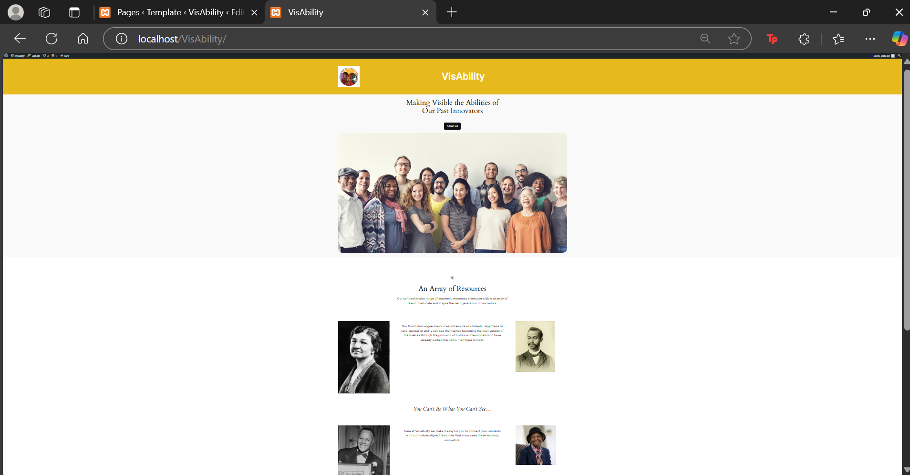
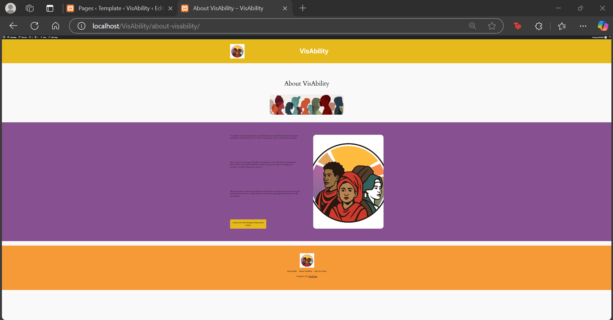
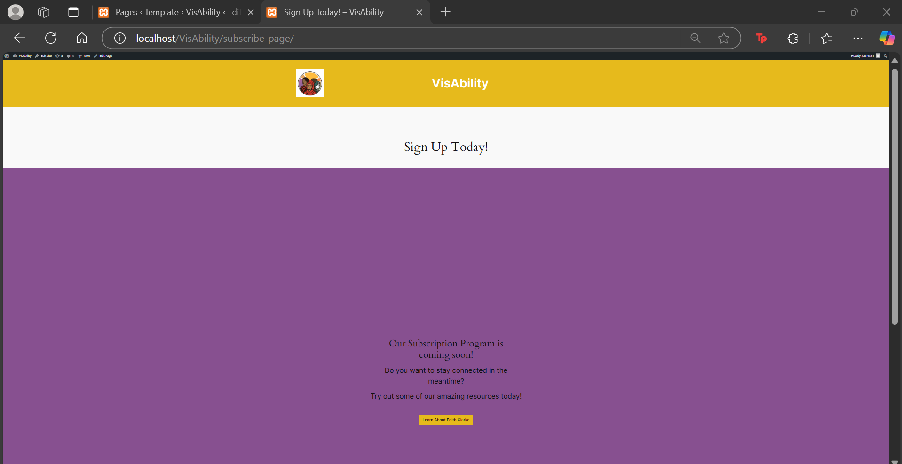
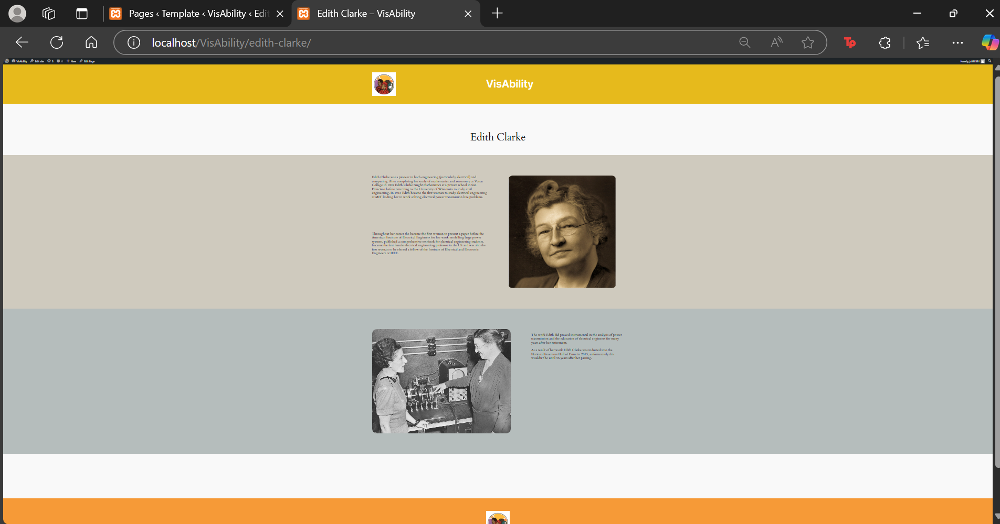

# CP3402-Learning-Journal-Week_4

## Learning Activities & Resources

## Estimated Hours
This week I spent approximately 4 hours completing various learning activities for this subject. 

## Content Insights

## Career/Employability/Learning Insights

## Screenshots of Website Running on Local Host
The below screenshots showcase my WordPress website running on a local host. This was achieved through the use of XAMPP. Once XAMPP was downloaded Apache and MySQL were activated and ____. Once the basic WordPress site was running the content and styles of the existing Cloudaccess WordPress site were exported and imported into the locally hosted version. 

