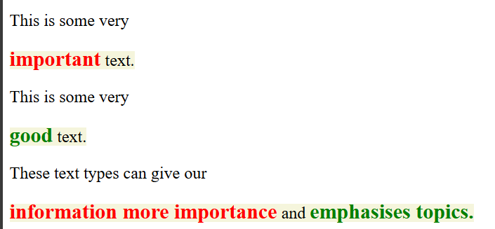
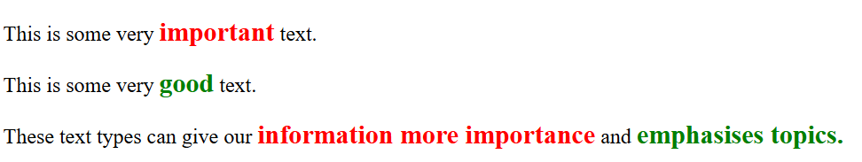

# CP3402-Learning-Journal-Week-9

## Learning Activities & Resources
* Learning Sass:
    * [W3 Schools Sass Tutorial](https://www.w3schools.com/sass/)
    * [W3 Schools inline div Tutorial](https://www.w3schools.com/html/html_blocks.asp)
    * [Wordpress Exporting Pages Tutorial](https://wordpress.com/support/export/)
    * [BookwormHead Youtube Tutorial - Installing Sass in VS Code](https://www.youtube.com/watch?v=DvqDO_EiQ6M)
* Sass in Industry:
    * [CSS Tricks Poll for Popularity of CSS Preprocessors](https://css-tricks.com/poll-results-popularity-of-css-preprocessors/)
    * [Skill Crush Sass Blog](https://skillcrush.com/blog/what-is-sass/)
    * [Codra Blog on Importance of Languages on your Application](https://www.ordinal.fr/en/topics/is-the-language-of-your-industrial-application-important)
    * [Their Stack - Companies Using Sass](https://theirstack.com/en/technology/sass)

## Estimated Hours
I spent approximately 4 hours completing various learning activities for CP3402 this week. 

## Content Insights
I learned that the `<span>` is an [inline HTML element](https://www.w3schools.com/html/html_blocks.asp). It can be used to add the functionality of a `<div>` element to a paragraph line, without causing a line break. In HTML, block-level elements always start on a new line and take up the full width available. Inline elements on the other hand, take up only as much width as required and do not start on a new line. A block-level element may include `<div>` or `<p>`, while `<span>` is an example of an inline element. I was encouraged to explore these element types while completing a practical application of Sass, using an automated workflow to create the CSS for a simple website. I was demonstrating the use of `@mixin` to give two classes (`important` and `good`) inherited attributes of font size and weight. However, when viewing the website, all text within these classes was displayed on separate lines:

* Sass Code
```
@mixin important-text {
    font-size: 25px;
    font-weight: bold;
}

.body {
    background-color: $background_colour;
    font-size: $paragraph_font_size;
    display: inline;

    .important{
        @include important-text;
        color: red;
    }

    .good{
        @include important-text;
        color: green;
    }
}
```
* HTML Code
```
<main class="body">
    <p>This is some very <div class="important">important</div> text.</p>
    <p>This is some very <div class="good">good</div> text.</p>
    <p>These text types can give our <div class="important">information more importance</div> and <div class="good">emphasises topics.</div></p>
</main>
```
* Output



After investigating and implementing the `<span>` element, the content of the website was formatted correctly, allowing specific pieces of text to appear within the same line:

* Sass Code - remained unchanged

* Updated HTML Code
```
<main class="body">
    <p>This is some very <span class="important">important</span> text.</p>
    <p>This is some very <span class="good">good</span> text.</p>
    <p>These text types can give our <span class="important">information more importance</span> and <span class="good">emphasises topics.</span></p>
</main>
```

* Output



## Career/Employability/Learning Insights
There have been ongoing conversations in recent years about the value of learning and using CSS preprocessors, particularly Sass. Some industry professionals believe that Sass is being phased out with new tools - such as [Vite](https://vite.dev/) - gaining traction as the 'standard'. However, others argue that Sass is still a valuable tool with a number of applications still relying on it, such as:
    * Twitter,
    * GitHub,
    * Shopify,
    * Slack
    * and many more
Resources also show that the more programming languages and tools you're proficient in, the greater your employability opportunities.

When considering Sass's career and industry relevance, its ability to streamline CSS development stands out. By promoting the development of cleaner, more maintainable code, Sass simplifies collaboration in large projects and enables the development of efficient and scalable programs. 

As a result of Sass's continued use in large companies, it remains a valuable skill in your professional toolbox. The streamlined processes Sass offers are proven to be a valuable career and employability resource, particularly in the web development industry. Although I am not currently pursuing a web development position, the skills I have gained in Sass provide an opportunity to stand out among other applicants and afford me new ways to improve my CSS programming.
